# <center> Quarkus</center>

Quarkus es un framework de Java diseñado para construir aplicaciones de forma rápida y eficiente, especialmente en entornos de microservicios y aplicaciones en la nube. Quarkus se basa en la tecnología de GraalVM, que permite compilar aplicaciones Java en binarios nativos, mejorando significativamente el rendimiento y la eficiencia junto con la implemetacion de programacion reactiva la cual permite trabajar con operaciones, eventos y flujos de forma asincrona.

<section style="background-color: white;">
<image src="https://quarkus.io/assets/images/home/quarkus_metrics_graphic_bootmem_wide.png">
</section>

> [!NOTE]
>
> Para obtener más información sobre Quarkus, haz clic en [Quarkus](https://quarkus.io/)


### ¿Qué es GraalVM?

GraalVM es una máquina virtual universal que soporta múltiples lenguajes de programación y permite la ejecución de aplicaciones en diferentes entornos. Una de las características más destacadas de GraalVM es su capacidad para compilar aplicaciones Java en binarios nativos. Esto significa que las aplicaciones pueden ejecutarse directamente en el sistema operativo sin necesidad de una máquina virtual Java (JVM), lo que reduce el tiempo de arranque y el uso de memoria.

<center>  </center>

> [!NOTE]
>
> Para obtener más información sobre GraalVM, haz clic en [GraalVM](https://www.graalvm.org/).
>

### programacion reactiva

La programación reactiva es un paradigma de programación que se basa en la reactividad, es decir, en la capacidad de responder a los eventos de forma eficiente y escalable. En este sentido, la programación reactiva se centra en la creación de aplicaciones que puedan responder a los eventos de forma rápida y eficiente, lo que permite mejorar la experiencia del usuario y la escalabilidad de las aplicaciones.


> [!NOTE]
>
> Para entender mas sobre la programacion reactiva en quarkus, haz clic en [Programacion reactiva](https://quarkus.io/guides/quarkus-reactive-architecture).
>
En Quarkus, para trabajar con programación reactiva, se utilizan Vert.x, Mutiny y Hibernate ORM con Panache las cuales son  dependencias necesarias para trabajar con programacion reactiva en quarkus.

#### vertx 
Es un motor de eventos que permite construir aplicaciones reactivas y escalables. Vert.x se basa en el modelo de actores, lo que significa que cada componente de la aplicación es un actor independiente que puede recibir y enviar mensajes de forma asíncrona. Esto permite construir aplicaciones reactivas que pueden responder a los eventos de forma eficiente y escalable.

##### dependencia necesaria para vertx

```xml
<dependency>
    <groupId>io.quarkus</groupId>
    <artifactId>quarkus-vertx</artifactId>
</dependency>
```

>[!NOTE]
>
> Para obtener más información sobre Vert.x y  dependencias mas especificas, haz clic en [Vert.x](https://es.quarkus.io/guides/vertx).

### Mutiny
Es una biblioteca reactiva que permite trabajar  operaciones, eventos y flujos de forma reactiva. Mutiny se basa en el modelo de programación reactiva, lo que significa que las operaciones se realizan de forma asíncrona y se pueden componer de forma eficiente y escalable.

se puede trabajar con dos tipos de resultados:
#### Uni y Multi
- Uni: representa un resultado unico ejemplo una consulta a la base de datos

- Multi: representa un resultado multiple ejemplo una lista de resultados de una consulta a la base de datos

#### dependencia necesaria para mutiny

```xml
<dependency>
    <groupId>io.quarkus</groupId>
    <artifactId>quarkus-mutiny</artifactId>
</dependency>

```
>[!NOTE]
>
> Para obtener más información sobre Mutiny y  dependencias mas especificas, haz clic en [Mutiny](https://quarkus.io/guides/mutiny-primer).

### Hibernate orm panache
Permite trabajar con una base de datos de forma reactiva y simplifica las operaciones de base de datos en aplicaciones reactivas.

#### Dependencias necesarias para hibernate orm panache

```xml
<dependency>
    <groupId>io.quarkus</groupId>
    <artifactId>quarkus-hibernate-orm-panache</artifactId>
</dependency>
```

```xml
<dependency>
    <groupId>io.quarkus</groupId>
    <artifactId>quarkus-hibernate-validator</artifactId>
</dependency>
```

> [!NOTE]
>
> Para obtener más información sobre Hibernate orm panache y  dependencias mas especificas, haz clic en [Hibernate orm panache](https://quarkus.io/guides/hibernate-orm-panache).

### Microservicios

Los microservicios son una arquitectura de software que divide una aplicación en pequeños servicios independientes que se comunican entre sí. Cada microservicio se encarga de una funcionalidad específica y puede desarrollarse, desplegarse y escalarse de forma independiente. Quarkus está optimizado para la creación de microservicios, proporcionando un entorno de desarrollo rápido y eficiente, así como herramientas para la integración y despliegue en la nube.

<center></center>

>[!NOTE]
>
> para obtener mas informacion sobre microservicios en quarkus, haz clic en [Microservicios](https://www.redhat.com/es/topics/microservices).


## Prerrequisitos para trabajar con Quarkus 
Para poder ejecutar, compilar y empaquetar un proyecto de Quarkus, es necesario tener instalado en el sistema las siguientes herramientas:

### Java
Quarkus requiere de una versión de Java 17 o superior para poder ejecutar y compilar aplicaciones. para este caso instalaremos el JDK 21 acompañado de GraalVM para poder compilar y empaquetar la aplicacion en un ejecutable nativo.

[Descargar GraalVM for JDK 21.0.5 ](https://www.oracle.com/java/technologies/downloads/#graalvmjava21-windows)

### Configuración de las variables de entorno
Para configurar las variables de entorno de Java, se debe seguir los siguientes pasos:

1. Descomprimir el archivo descargado de GraalVM en una carpeta de preferencia.
2. Crear una nueva variable de entorno llamada `JAVA_HOME`,`GRAALVM_HOME` y asignarle la ruta de la carpeta donde se descomprimió GraalVM. 
Por ejemplo:
```
GRAALVM_HOME=C:\Program Files\GraalVM\graalvm-jdk-21.0.5+9.1
JAVA_HOME=C:\Program Files\GraalVM\graalvm-jdk-21.0.5+9.1
```
3. Editar la variable de entorno `Path` y agregar la ruta de la carpeta `bin` de GraalVM.
Por ejemplo:
```
%JAVA_HOME%\bin
%GRAALVM_HOME%\bin
```
4. Para verificar que la instalación de Java se realizó correctamente y de las variables de entorno, abrir una terminal y ejecutar el siguiente comando:
```
java -version
echo %JAVA_HOME%
echo %GRAALVM_HOME%
```

### IDE
Para el desarrollo de aplicaciones con Quarkus, se recomienda utilizar IDE intellij IDEA debido a que es una de las herramientas más completas y con mayor soporte para el desarrollo de aplicaciones con Quarkus. Para instalar intellij IDEA, se debe seguir los siguientes pasos:

1. Descargar el instalador de intellij IDEA Community 2024-3 desde el siguiente enlace: [https://www.jetbrains.com/idea/download/](https://www.jetbrains.com/es-es/idea/download/?section=windows).

2. Ejecutar el instalador descargado y seguir los pasos que se indican en el asistente de instalación.

3. Una vez finalizada la instalación, abrir intellij IDEA y ir al a opcion de plugins en el menú de configuración y seleccionar los siguientes plugins 
   - Quarkus Tools
   - Lombok
   - Docker
   - Github Copilot
  
  <center> 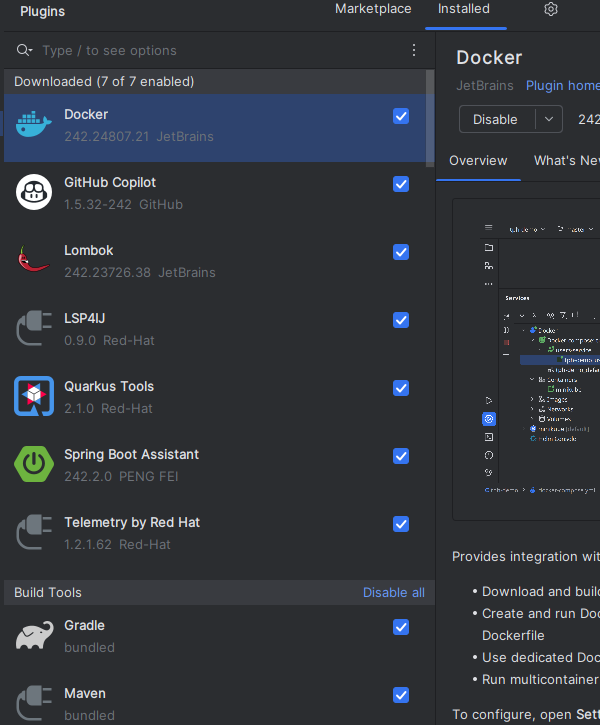 </img></center>

### Apache Maven
Maven es una herramienta de gestión y construcción de proyectos Java. Quarkus utiliza Maven para gestionar las dependencias, Para instalar Apache Maven, se debe Descargar el archivo binario de Apache Maven-3.9.9 desde el siguiente enlace: [https://maven.apache.org/download.cgi](https://maven.apache.org/download.cgi).

### Configuración de las variables de entorno
Para configurar las variables de entorno de Maven, se debe seguir los siguientes pasos:

1. Descomprimir el archivo descargado de Apache Maven en una carpeta de preferencia.
2. Crear una nueva variable de entorno llamada `MAVEN_HOME` y asignarle la ruta de la carpeta donde se descomprimió Apache Maven.
Por ejemplo:
```
MAVEN_HOME=C:\Program Files\apache-maven-3.9.9
```
3. Editar la variable de entorno `Path` y agregar la ruta de la carpeta `bin` de Apache Maven.
Por ejemplo:
```
%MAVEN_HOME%\bin
```

### Docker Desktop
Docker Desktop es una herramienta que permite la creación, administración y ejecución de contenedores Docker en sistemas operativos Windows y macOS; en nuestro caso, se utilizará Docker Desktop para ejecutar contenedores de aplicaciones Quarkus en un entorno de desarrollo local

Para instalar Docker Desktop, se debe seguir los siguientes pasos:

1. Descargar el instalador de Docker Desktop v.4.36.0 desde el siguiente enlace: [https://www.docker.com/products/docker-desktop](https://www.docker.com/products/docker-desktop/).

2. Ejecutar el instalador descargado y seguir los pasos que se indican en el asistente de instalación.

> [!NOTE]
>  Para obtener más información sobre docker, haz clic en [Docker](https://www.docker.com/).
>

## Creación de un proyecto Quarkus
Para crear un proyecto Quarkus, hay varias formas para hacerlo.
1. Crear un proyecto Quarkus desde la línea de comandos [Quarkus CLI](https://quarkus.io/guides/cli-tooling)
2. Crear un proyecto Quarkus desde la página web de Quarkus utilizando el siguiente enlace: [https://code.quarkus.io/](https://code.quarkus.io/).
3. Crear un proyecto Quarkus desde el IDE IntelliJ IDEA utilizando el asistente de creación de proyectos, en nuestro caso, se utilizará esta opción.
      3.1. Tener instalado el plugin de Quarkus Tools en IntelliJ IDEA.

      3.2. Ir a la opción de `File` -> `New` -> `Project` y seleccionar la opción de `Quarkus` en el asistente de creación de proyectos.

      3.2.1 como es la primera vez que se crea un proyecto de quarkus con graalvm en la opcion de `Project SDK`debemos desplegar el menu y seleccionar la opcion de `Add SDK` y seleccionar la carpeta donde se encuentra el graalvm

      <center>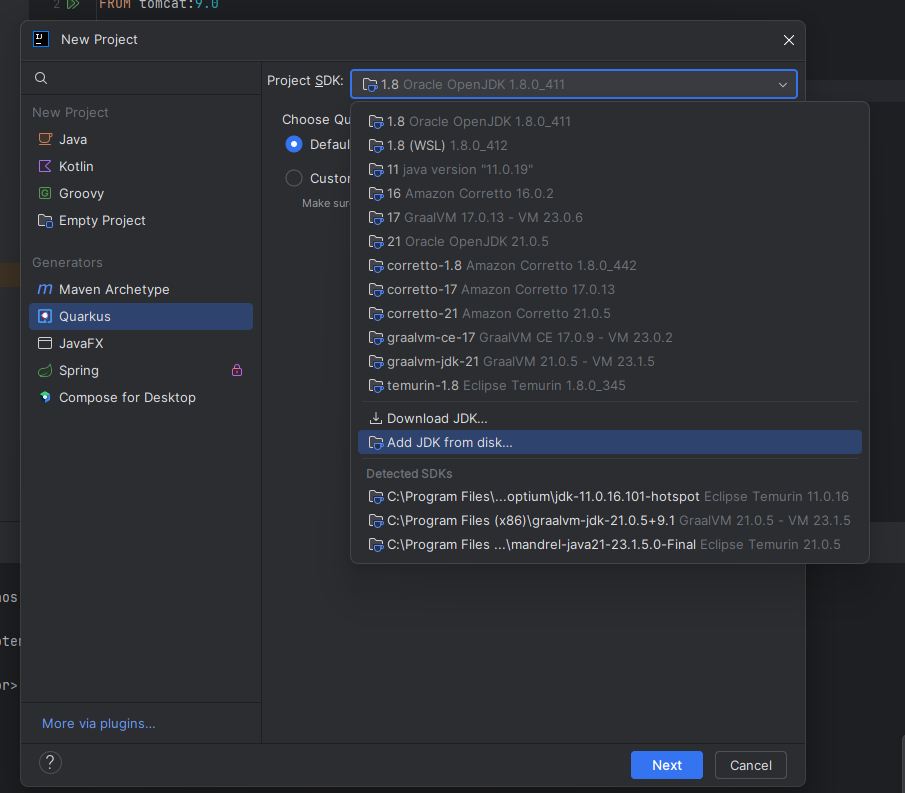</img></center>

      <center>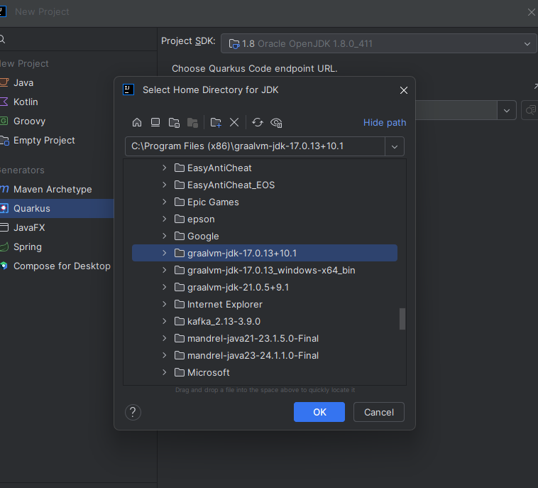</img></center>

      <center>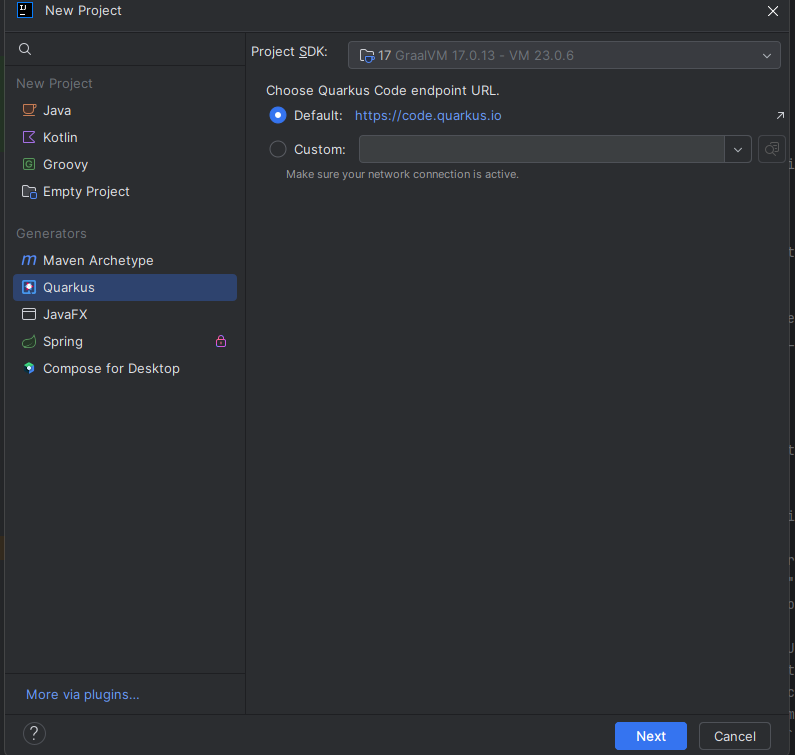</img></center>


      3.3. Seleccionar las opciones de configuración del proyecto, como el nombre del proyecto, el grupo y la versión de Quarkus.

      <center>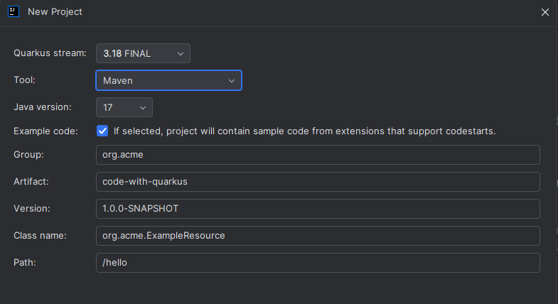</img></center>

      3.4. También se pueden seleccionar las extensiones de Quarkus que se desean agregar al proyecto, como Hibernate ORM, RESTEasy, etc.

      <center> 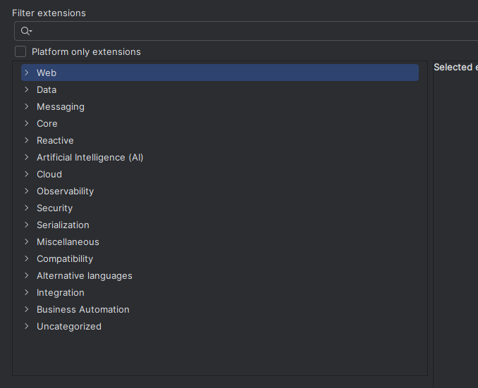</img> </center>


## Estructura de un proyecto Quarkus
Al momento de crear un proyecto Quarkus, se generan una serie de carpetas y archivos que conforman la estructura del proyecto. A continuacion se muestra una estructura basica de un proyecto Quarkus

<center>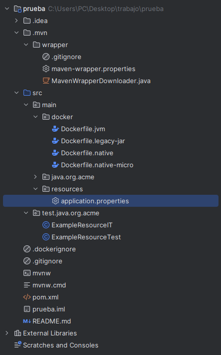</img> </center>

#### .mvn
Esta carpeta contiene los archivos de configuración de Maven, como el archivo `wrapper.properties` que se utiliza para configurar el wrapper de Maven. El wrapper de Maven es una herramienta que permite ejecutar Maven sin necesidad de instalarlo en el sistema.

#### src
Esta carpeta contiene el código fuente del proyecto, dividido en diferentes subcarpetas:
- `main`: contiene el código fuente principal del proyecto, como las clases Java y los recursos de la aplicación.
  - `java`: contiene las clases Java del proyecto.
  - `resources`: contiene los recursos de la aplicación, como archivos de configuración, propiedades y plantillas.
  - `docker`: contiene los archivos de configuración de Docker para la creación de contenedores.
    - `Dockerfile.jvm`: archivo de configuración de Docker para la creación de un contenedor con la JVM.
    - `Dockerfile.legacy-jar`: archivo de configuración de Docker para la creación de un contenedor con un JAR legado el cual es un archivo que contiene el código fuente de la aplicación y las dependencias.
    - `Dockerfile.native`: archivo de configuración de Docker para la creación de un contenedor con un ejecutable nativo que se compila con GraalVM.
    - `Dockerfile.native-micro`: archivo de configuración de Docker para la creación de un contenedor el cual sera mas pequeño y ligero que el contenedor de Dockerfile.native debido a que solo contiene el ejecutable nativo.

  - `test`: contiene el código fuente de las pruebas unitarias y de integración del proyecto.
  
#### target
Esta carpeta contiene los archivos generados por Maven durante el proceso de compilación y empaquetado del proyecto

#### Pom.xml
Este archivo es el archivo de configuración de Maven y contiene la información del proyecto, como las dependencias, los plugins y las configuraciones de Maven.

#### README.md
todo proyecto de quarkus tiene un archivo README.md el cual contiene algunas instrucciones donde se explica como ejecutar el proyexto en modo desarrollo y como empaquear el proyecto en cada una de las diferentes formas de empaquetado.

## Ejemplo de un Microservicio en Quarkus
Ahora crearemos un microservicio en Quarkus que se conectará a una base de datos y expondrá un servicio REST para realizar operaciones CRUD sobre los datos de la base de datos. 
Este microservicio es el mismo que esta ubicado  [aqui](./JDK17/pjba_microservicio_cliente/) asi que este es un primer acercamiento a la creacion de un microservicio en quarkus.

Para ello, seguiremos los siguientes pasos:

### Agregar dependencias 
lo primero que haremos una vez creado el proyecto es agregar las dependencias necesarias para trabajar con una base de datos en quarkus, en este caso trabajaremos con las dependencias de [hibernate orm panache](https://quarkus.io/guides/hibernate-orm-panache), [vertx](https://quarkus.io/guides/vertx), [mutiny](https://quarkus.io/guides/mutiny-primer) y [REST](https://quarkus.io/guides/rest)

### Creacion de las entidades

Crearemos una entidad que represente los datos de la base de datos, en este caso crearemos una carpeta llamada controlador sen la carpeta main/java y crearemos una clase llamada Product.java que representará los datos de un producto

[!NOTE]
> creamos la entidad product ya que es la entidad hija de la entidad customer y estos datos lo recibiremos del microservicio de product que se encuentra en el siguiente [enlace](./JDK17/pjba_microservicio_product/)


La clase Product.java debe tener las siguientes anotaciones:

```java
package com.avvillas.controlador;

import com.fasterxml.jackson.annotation.JsonBackReference;
import io.quarkus.hibernate.reactive.panache.PanacheEntity;
import jakarta.persistence.*;
import lombok.Data;

@Entity
@Data // Lombok genera los getter y setter
public class Product extends PanacheEntity { // PanacheEntity es una clase que nos permite hacer operaciones CRUD gracias a Hibernate ORM Panache nos facilita el trabajo con la base de datos

    @Transient // indica que el campo no se mapea a la base de datos y se usa solo para almacenar datos de manera temporal
    private Long id;

    
    @ManyToOne// muchos productos pueden pertenecer a un cliente
    @JoinColumn(name = "customer", referencedColumnName = "id") // indica que la columna customer de la tabla product es una clave foranea que referencia a la columna id de la tabla customer

    @JsonBackReference // evita la recursividad en la serializacion de los datos tomando a customer como el padre y product como el hijo
    private Customer customer; // un producto pertenece a un cliente
    @Column // indica que el campo es una columna de la tabla product
    private Long product; // codigo del producto

    // almacenaran los datos del producto de manera temporal
    @Transient
    private String name;
    @Transient
    private String code;
    @Transient
    private String description;
}
```
> [!NOTE]
>  no debemos crear los getter y setter de los atributos de la clase Product.java ya que lombok se encarga de generarlos automaticamente y el panaheEntity nos permite hacer operaciones CRUD sobre la base de datos sin necesidad de crear un repositorio para la entidad 

Ahora crearemos una entidad para el cliente que sera el padre de la entidad product, para ello crearemos una clase llamada Customer.java en la carpeta controlador en la carpeta main/java que representará los datos de un cliente. La clase Customer.java debe tener las siguientes anotaciones:

```java
package com.avvillas.controlador;

import com.fasterxml.jackson.annotation.JsonManagedReference;
import io.quarkus.hibernate.reactive.panache.PanacheEntity;

import jakarta.persistence.*;
import lombok.Data;

import java.util.List;

@Entity
@Data // Lombok genera los getter y setter

public class Customer extends PanacheEntity { // PanacheEntity es una clase que nos permite hacer operaciones CRUD

    //Ahora vamos a definir los campos de la tabla
    private String code;
    private String accountNumber;
    private String names;
    private String surname;
    private String phone;
    private String address;
    //Ahora vamos a definir la relación con la tabla Product
    @OneToMany(mappedBy = "customer",cascade = {CascadeType.ALL},fetch = FetchType.EAGER) // un cliente puede tener varios productos
    @JsonManagedReference
    private List<Product> products; // lista de productos que tiene el cliente

    //Ahora vamos a definir el metodo toString, el cual nos permite imprimir los datos de un cliente
    @Override
    public String toString() {
        return "Customer{" +
                "code='" + code + '\'' +
                ", accountNumber='" + accountNumber + '\'' +
                ", names='" + names + '\'' +
                ", surname='" + surname + '\'' +
                ", phone='" + phone + '\'' +
                ", address='" + address + '\'' +
                '}';
    }
}
```

> [!NOTE]
> esta entidad es la entidad padre de la entidad product y la relacion entre estas dos entidades es de uno a muchos ya que un cliente puede tener varios productos y un producto pertenece a un solo cliente

### Creacion del modelo de datos
Ahora crearemos un modelo de datos que represente los datos de la base de datos, en este caso crearemos una carpeta llamada modelo en la carpeta main/java y crearemos una clase llamada clsCustomerApi.java que representará los datos de un cliente nos permitira hacer operaciones CRUD sobre la base de datos es decir crear, leer, actualizar y eliminar registros de la base de datos

La clase clsCustomerApi.java debe tener las siguientes anotaciones:

```java
package com.avvillas.modelo;

import com.avvillas.controlador.Customer;
import com.avvillas.controlador.Product;
import com.fasterxml.jackson.core.JsonProcessingException;
import com.fasterxml.jackson.databind.ObjectMapper;
import io.quarkus.hibernate.reactive.panache.Panache;
import io.quarkus.hibernate.reactive.panache.PanacheEntityBase;
import io.quarkus.panache.common.Sort;

import io.smallrye.mutiny.Multi;
import io.smallrye.mutiny.Uni;

import io.vertx.core.json.JsonArray;
import io.vertx.ext.web.client.WebClientOptions;
import io.vertx.mutiny.core.Vertx;
import io.vertx.mutiny.ext.web.client.WebClient;

import jakarta.annotation.PostConstruct;
import jakarta.inject.Inject;
import jakarta.ws.rs.*;
import jakarta.ws.rs.core.MediaType;
import jakarta.ws.rs.core.Response;
import lombok.extern.slf4j.Slf4j;
import org.eclipse.microprofile.config.inject.ConfigProperty;
import org.eclipse.microprofile.reactive.messaging.Channel;
import org.eclipse.microprofile.reactive.messaging.Emitter;


import java.util.ArrayList;
import java.util.List;

import static io.smallrye.mutiny.helpers.spies.Spy.onFailure;
import static org.jboss.resteasy.reactive.RestResponse.StatusCode.NOT_FOUND;
import static org.jboss.resteasy.reactive.RestResponse.StatusCode.NO_CONTENT;


@Slf4j // para mejorar la salida de los logs
@Path("/customer") // indica que la clase es un recurso REST y que se accede a traves de la ruta /customer ejemplo: http://localhost:8080/customer
@Produces(MediaType.APPLICATION_JSON) // indica que el recurso produce datos en formato JSON
@Consumes(MediaType.APPLICATION_JSON) // indica que el recurso consume datos en formato JSON
public class ClsCustomerApi {
    @Inject
    Vertx vertx; 

    @ConfigProperty(name = "product.url") // se obtiene la url del microservicio de product
    String productServiceUrl; // url del microservicio de product

    private WebClient webClient; // cliente web para hacer peticiones al microservicio de product

    @PostConstruct // este contructor permite inicializar el cliente web
    void initialize() {
        this.webClient = WebClient.create(vertx,
                new WebClientOptions().setDefaultHost(productServiceUrl)
                        .setSsl(false).setTrustAll(true)); // se inicializa el cliente web con la url del microservicio de product y se deshabilita el ssl
    }


    // busca todos los registros de la tabla el names es el campo por el cual se ordena
    @GET
    public Uni<List<PanacheEntityBase>> list() { // nos busca todos los registros de la tabla el names es el campo por el cual se ordena
        return Customer.listAll(Sort.by("names")) // se ordena por el campo name
                .onItem().invoke(customers -> log.info("Retrieved customers: " + customers)) // si es exitoso se imprime el resultado
                .onFailure().invoke(e -> log.error("Error retrieving customers", e)); // si hay un error se imprime el error
    }

    // busca un registro por el id
    @GET
    @Path("/{Id}")
    public Uni<PanacheEntityBase> getById(@PathParam("Id") Long Id) { // busca un registro por el id
        return Customer.findById(Id) // busca un registro por el id
                .onItem().ifNotNull().invoke(customer -> log.info("Retrieved customer: " + customer)) // si es exitoso se imprime el resultado
                .onItem().ifNull().failWith(() -> new WebApplicationException("Customer not found", NOT_FOUND)) // si es nulo se imprime un mensaje de error
                .onFailure().invoke(e -> log.error("Error retrieving customer", e)); // si hay un error se imprime el error
    }

    // agrega un registro
    @POST
    public Uni<Response> add(Customer c) { // agrega un registro
        if (c == null) { // si el registro es nulo
            log.error("Customer is null");
            return Uni.createFrom().item(Response.status(Response.Status.BAD_REQUEST).entity("Customer cannot be null").build()); // nos indica que el registro no puede ser nulo
        }
        log.info("Adding customer: " + c); // si no es nulo se imprime el registro
        return Panache.withTransaction(c::persist) // se persiste el registro, los :: son para referenciar un metodo en este caso persist
                .onItem().transform(inserted -> Response.status(Response.Status.CREATED).build()) // si es exitoso indica que se creo el registro
                .onFailure().invoke(e -> log.error("Error persisting customer", e)); // si hay un error se imprime el error
    }


    // Actualiza un registro
    @PUT
    @Path("/{Id}")
    public Uni<Response> update(@PathParam("Id") Long Id, Customer c) { // Actualiza un registro
        return Panache
                .withTransaction(() -> Customer.<Customer>findById(Id) // busca el registro por el id
                        .onItem().ifNotNull().invoke(customer -> { // si es diferente de nulo
                            customer.setAccountNumber(c.getAccountNumber()); // se actualiza el campo accountNumber
                            customer.setNames(c.getNames()); // se actualiza los campos
                            customer.setSurname(c.getSurname());
                            customer.setPhone(c.getPhone());
                            customer.setAddress(c.getAddress());
                            customer.setProducts(c.getProducts());
                        })
                )
                .onItem().ifNotNull().transform(entity -> Response.ok(entity).build())
                .onItem().ifNull().continueWith(Response.status(NOT_FOUND)::build)
                .onFailure().invoke(e -> log.error("Error updating customer", e)); // se imprime el error
    }

    // Elimina un registro
    @DELETE
    @Path("/{Id}")
    public Uni<Response> delete(@PathParam("Id") Long Id) { // Elimina un registro
        return Panache.withTransaction(() -> Customer.deleteById(Id)) // se elimina el registro por el id
                .onItem().transform(deleted -> deleted
                        ? Response.ok().status(NO_CONTENT).build()
                        : Response.status(NOT_FOUND).build())
                // el ? es un operador ternario si es verdadero se imprime el mensaje de que se elimino el registro
                // el : es un operador ternario si es falso se imprime el mensaje de que no se encontro el registro
                .onFailure().invoke(e -> log.error("Error deleting customer", e)); // si hay un error se imprime el error
    }

    // obtengo los productos del microservicio de product
    @GET
    @Path("/{Id}/product") // obtengo los productos del microservicio de product
    public Uni<Customer> getByIdProduct(@PathParam("Id") Long Id) { // obtengo los productos del microservicio de product
        log.info("Fetching customer with ID: " + Id); // se imprime el id del cliente
        return Uni.combine().all().unis(getCustomerReactive(Id), getAllProducts()) // se obtiene el cliente y los productos
                .asTuple() // se convierte en una tupla
                .map(tuple -> { // se mapea la tupla
                    Customer customer = tuple.getItem1(); // se obtiene el cliente
                    List<Product> products = tuple.getItem2(); // se obtiene los productos
                    log.info("Customer: " + customer); 
                    log.info("Products: " + products);
                    customer.getProducts().forEach(product -> { // se recorre los productos
                        products.forEach(p -> { // se recorre los productos
                            log.info("Ids are: " + product.getProduct() + " = " + p.getId()); // se imprime los ids
                            if (product.getProduct().equals(p.getId())) { // si los ids son iguales
                                product.setName(p.getName()); // se actualiza el nombre
                                product.setDescription(p.getDescription()); // se actualiza la descripcion
                            }
                        });
                    });
                    return customer;
                })
                .onFailure().retry().atMost(3) // si hay un error se intenta 3 veces
                .onFailure().invoke(e -> log.error("Error fetching customer or products", e)) // si hay un error se imprime el error
                .onFailure().recoverWithItem(e -> { 
                    log.error("Recovering from error: ", e); // si hay un error se imprime el error
                    Customer errorCustomer = new Customer(); // se crea un objeto de tipo Customer
                    errorCustomer.setNames("Error fetching: " + e.getMessage()); // se le asigna un mensaje de error
                    return errorCustomer; // se retorna el mensaje de error
                });
    }

 // obtengo los productos del microservicio de product
    @GET // indica que el metodo es un servicio REST de tipo GET
    @Path("/products") // indica que la ruta del servicio es /products
    public Uni<List<Product>> getAllProducts(){ // obtengo los productos del microservicio de product
        return webClient.get(8081, "localhost", "/product").send() // se hace una peticion al microservicio de product
                .onFailure().invoke(res -> log.error("Error recuperando productos ", res)) // si hay un error se imprime el error
                .onItem().transform(res -> { // si es exitoso
                    List<Product> lista = new ArrayList<>(); // se crea una lista de productos
                    JsonArray objects = res.bodyAsJsonArray(); // se obtiene los objetos de la respuesta
                    objects.forEach(p -> { // se recorre los objetos
                        log.info("See Objects: " + objects); // se imprime los objetos
                        ObjectMapper objectMapper = new ObjectMapper(); // se crea un objeto de tipo ObjectMapper que permite convertir un objeto a JSON
                        
                        Product product = null; // se crea un objeto de tipo Product
                        try {
                            product = objectMapper.readValue(p.toString(), Product.class); // se convierte el objeto a JSON
                        } catch (JsonProcessingException e) { 
                            e.printStackTrace();
                        }
                        lista.add(product); // se agrega el producto a la lista
                    });
                    return lista;
                });
    }

    private Uni<Customer> getCustomerReactive(Long Id){ 
        return Customer.findById(Id); 
    }

}
```

> [!NOTE]
> Como se puede observar en el codigo anterior se esta trabajando con una base de datos de forma asincrona y se esta haciendo uso de mutiny para trabajar con los datos de la base de datos de forma reactiva y mediante el uso de vertx se esta haciendo una peticion a un microservicio de product para obtener los datos de los productos

### Configuración base de datos en Quarkus

En quarkus se puede trabajar con diferentes bases de datos como mysql, postgresql, sqlserver, etc; hay dos formas de trabajar con una base de datos en quarkus de forma sincrona la cual permite  bloquear el hilo de ejecucion hasta que se obtenga una respuesta de la base de datos y de forma asincrona la cual no bloquea el hilo de ejecucion y es eficiente para aplicaciones reactivas. A continuacion se explicara como configurar una base de datos en quarkus.

#### Configuración de una base de datos de forma sincrona

Para la configuracion de una base de datos de forma sincrona se debe agregar las siguientes dependencias en el archivo pom.xml

```xml
<dependency>
    <groupId>io.quarkus</groupId>
    <artifactId>quarkus-jdbc-mssql</artifactId>
</dependency>

```

Para la configuracion de la base de datos se debe agregar las siguientes propiedades en el archivo aplication.properties

``` properties

quarkus.datasource.db-kind=mssql
quarkus.datasource.username=user
quarkus.datasource.password=pass
quarkus.datasource.jdbc.url=jdbc:sqlserver://localhost:1433/name_db
quarkus.datasource.jdbc.max-size=20

```

- se trabaja con jdbc para la conexion a la base de datos de forma sincrona y se bloquea el hilo de ejecucion hasta que se obtenga una respuesta de la base de datos

#### Configuración de una base de datos de forma asincrona

Para la configuracion de una base de datos de forma asincrona que es la que usamos para el microservicio customer se debe agregar las siguientes dependencias en el archivo pom.xml

```xml
    <dependency>
        <groupId>io.quarkus</groupId>
        <artifactId>quarkus-reactive-mssql-client</artifactId>
    </dependency>
```

esta dependencia es el controlador de base de datos reactiva para mssql. Hibernate Reactive usa ese controlador para interactuar con la base de datos sin bloquear el subproceso del llamador.

para la configuracion de la base de datos se debe agregar las siguientes propiedades en el archivo aplication.properties

```properties
quarkus.datasource.db-kind=mssql
quarkus.datasource.username=user
quarkus.datasource.password=Pass
quarkus.datasource.reactive.url=vertx-reactive:sqlserver://localhost:1433/name_db
quarkus.datasource.reactive.max-size=20
quarkus.datasource.jdbc=false 
```

- se trabaja con vertx-reactive para la conexion a la base de datos de forma asincrona y no se bloquea el hilo de ejecucion

> [!NOTE]
>
> el jdbc= false indica que se va a trabajar con una base de datos reactiva ya que el jdbc se trabaja con una base de datos de forma sincrona y la idea es que sea de manera asincroica y la aplication properties tiene por defecto el jbc

#### Conexión externa a la base de datos
Para conectar quarkus con un db donde su properties estan en una ruta especifica se debe agregar la siguiente propiedad en el archivo aplication.properties

``` properties
quarkus.cofig.locations=classpath:application.properties, file:/path/to/properties
```
el classpath:application.properties es la ruta por defecto de las propiedades de la aplicacion y el file:/path/to/properties es la ruta donde se encuentra el archivo de propiedades de la base de datos


> [!NOTE]
>
> hay diferentes configuraciones para trabajar con una base de datos de forma asincrona y local o en la nube

#### JDBC vs vertx-reactive

- JDBC: 
    - se trabaja de forma sincrona
    - se bloquea el hilo de ejecucion hasta que se obtenga una respuesta de la base de datos
    - no es eficiente para aplicaciones reactivas
- vertx-reactive: 
    - se trabaja de forma asincrona
    - no se bloquea el hilo de ejecucion 
    - es eficiente para aplicaciones reactivas

> [!NOTE]
>
> Para obtener más información sobre la configuracion de una base de datos en quarkus, haz clic en [Configuracion de base de datos](https://quarkus.io/guides/datasource).

# instalación de una base de datos en docker
En nuestro caso vamos a trabajar con una base de datos sqlserver y la ejecutaremos desde un contenedor de docker, lo puedes manejar tambein con una base de datos local o en la nube.

para la instalacion de una base de datos en docker se debe seguir los siguientes pasos

1. Descargar imagen de la base de datos que se va a instalar en este caso sqlserver

```bash
docker pull mcr.microsoft.com/mssql/server:2017-latest
```
2. Crear contenedor con la imagen de sqlserver
```bash
docker run -e 'ACCEPT_EULA=Y' -e 'SA_PASSWORD=YourStrong!Passw0rd' -p 1433:1433 --name sqlserver2017 -d mcr.microsoft.com/mssql/server:2017-latest
```

3. Verificar que el contenedor este corriendo
```bash
docker ps
```

### Crear bd y usuario en la imagen de sqlserver
para crear la base de datos y el usuario en la imagen de sqlserver se puede se copia los archivos .sql a la imagen de sqlserver

> [!NOTE]
>en los proyectos ya creados com oen el JDK17 se encuentra un archivo db.sql para cada microservicio que contiene las instrucciones para crear la base de datos y el usuario en la imagen de sqlserver 

En nuestro caso el archivo db.sql contiene las siguientes instrucciones

Para nuestro microservicio de customer se va a crear una base de datos llamada customer_db y un usuario llamado customer_user con la contraseña CusT0mer!pass y se le van a otorgar permisos de db_owner; el archivo se llamada customer_db.sql y contiene las siguientes instrucciones

```sql
-- Crear la base de datos
CREATE DATABASE customer_db;
GO

-- Usar la base de datos
USE customer_db;
GO

-- Crear el usuario
CREATE LOGIN customer_user WITH PASSWORD = 'Cust0mer!Pass';
GO
CREATE USER customer_user FOR LOGIN customer_user;
GO

-- Otorgar permisos al usuario
ALTER ROLE db_owner ADD MEMBER customer_user;
GO

-- Crear la tabla Customer
CREATE TABLE Customer (
    id BIGINT IDENTITY PRIMARY KEY, -- PanacheEntity usa 'id' como clave primaria
    code VARCHAR(255) NOT NULL,
    accountNumber VARCHAR(255) NOT NULL,
    names VARCHAR(255) NOT NULL,
    surname VARCHAR(255) NOT NULL,
    phone VARCHAR(255) NOT NULL,
    address VARCHAR(255) NOT NULL
);
GO

-- Crear la tabla Product
CREATE TABLE Product (
    id BIGINT IDENTITY PRIMARY KEY, -- PanacheEntity usa 'id' como clave primaria
    customer BIGINT, -- Clave foránea que referencia a Customer
    product BIGINT NOT NULL,
    CONSTRAINT fk_customer FOREIGN KEY (customer) REFERENCES Customer(id)
);
GO

-- Insertar datos en la tabla Customer
INSERT INTO Customer (code, accountNumber, names, surname, phone, address) VALUES ('C001', '001', 'John', 'Doe', '123456789', '123 Main St');
INSERT INTO Customer (code, accountNumber, names, surname, phone, address) VALUES ('C002', '002', 'Jane', 'Doe', '987654321', '456 Elm St');

-- Insertar datos en la tabla Product
INSERT INTO Product (customer, product) VALUES (1, 1001);
INSERT INTO Product (customer, product) VALUES (1, 1002);
INSERT INTO Product (customer, product) VALUES (2, 2001);
-- Insert data into the Customer table


INSERT INTO Customer (code, accountNumber, names, surname, phone, address) VALUES ('C001', '001', 'John', 'Doe', '123456789', '123 Main St');
INSERT INTO Customer (code, accountNumber, names, surname, phone, address) VALUES ('C002', '002', 'Jane', 'Doe', '987654321', '456 Elm St');
INSERT INTO Customer (code, accountNumber, names, surname, phone, address) VALUES ('C003', '003', 'Alice', 'Smith', '456123789', '789 Oak St');
INSERT INTO Customer (code, accountNumber, names, surname, phone, address) VALUES ('C004', '004', 'Bob', 'Smith', '789456123', '159 Pine St');
```
Con el archivo db.sql se puede crear la base de datos y el usuario en la imagen de sqlserver de la siguiente manera

```bash
docker start sqlserver2017 // para iniciar contenedor de sqlserver


docker cp ruta/basedatos_db.sql sqlserver2017:/basedatos_db.sql // copiar el archivo db.sql a la imagen de sqlserver

docker exec -it sqlserver2017 /opt/mssql-tools/bin/sqlcmd -S localhost -U SA -P 'YourStrong!Passw0rd' -i /basedatos_db.sql // ejecutar el archivo db.sql en el contenedor de sqlserver
```

> [!IMPORTANT]
> este paso se debe realizar para nuestro microservicio de product ya que para futuro ejercicios se va a trabajar con la base de datos de el microservicio de product product.sql asi que solo se debe cambiar el nombre del archivo db.sql por product.sql y el nombre de la base de datos por product_db y el nombre del usuario por product_user y la contraseña por ProdUct!pass

```sql

-- Crear la base de datos
CREATE DATABASE product_db;
GO

-- Usar la base de datos
USE product_db;
GO

-- Crear el usuario
CREATE LOGIN product_user WITH PASSWORD = 'Pr0duct!pass';
GO
CREATE USER product_user FOR LOGIN product_user;
GO

-- Otorgar permisos al usuario
ALTER ROLE db_owner ADD MEMBER product_user;
GO

-- Crear la tabla Product
CREATE TABLE Product (
    id BIGINT IDENTITY PRIMARY KEY, -- PanacheEntity usa 'id' como clave primaria
    code VARCHAR(255) NOT NULL,
    name VARCHAR(255) NOT NULL,
    description VARCHAR(255) NOT NULL
);
GO

-- Insertar datos en la tabla Product
INSERT INTO Product (code, name, description) VALUES ('P001', 'Product 1', 'Description for Product 1');
INSERT INTO Product (code, name, description) VALUES ('P002', 'Product 2', 'Description for Product 2');
INSERT INTO Product (code, name, description) VALUES ('P003', 'Product 3', 'Description for Product 3');

```

### dependencias adicionales
-Swagger-ui permite visualizar y probar los servicios REST de la aplicación. Para habilitar Swagger-ui, se debe agregar la siguiente dependencia en el archivo pom.xml

```xml
<dependency>
    <groupId>io.quarkus</groupId>
    <artifactId>quarkus-smallrye-openapi</artifactId>
</dependency>
```

- Para habilitar la generación de documentación OpenAPI, se debe agregar la siguiente propiedad en el archivo application.properties

```properties 

# Swagger UI configuration 
quarkus.swagger-ui.path=/swagger-ui # ruta de acceso a swagger-ui
quarkus.swagger-ui.always-include=true # indica que siempre se incluya swagger-ui
mp.openapi.extensions.smallrye.info.title=Customer API # titulo de la documentacion
%dev.mp.openapi.extensions.smallrye.info.title=Customer API(development) # titulo de la documentacion en modo desarrollo
%test.mp.openapi.extensions.smallrye.info.title=Customer API (test) # titulo de la documentacion en modo test
mp.openapi.extensions.smallrye.info.version=1.0.1 # version de la documentacion
mp.openapi.extensions.smallrye.info. description=Microservicio de clientes # descripcion de la documentacion 

```

>[!NOTE]
> Para obtener más información sobre la documentacion de una api en quarkus, haz clic en [Documentacion de swagger-ui](https://quarkus.io/guides/openapi-swaggerui).


### Ejecutar el microservicio en modo desarrollo
Quarkus nos permite nuestros servicios en modo desarrollo,el cual nos permite realizar cambios en el código fuente y ver los cambios reflejados en tiempo real sin necesidad de reiniciar el servidor. Para ejecutar el microservicio en modo desarrollo, se debe seguir los siguientes pasos:

1. Abrir una terminal y ejecutar el siguiente comando para iniciar el microservicio en modo desarrollo, tener en cuenta que el microservicio debe estar en la carpeta raiz del proyecto
   
```bash
./mvnw compile quarkus:dev
```
una vez escrita esta linea de codigo aparecera lo siguiente en la terminal

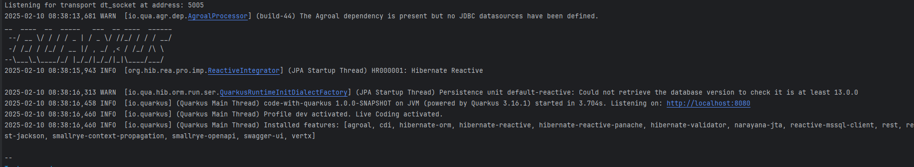

iremos a la ruta http://localhost:8080/q/dev-ui/ para visualizar la interfaz en modo desarrollo


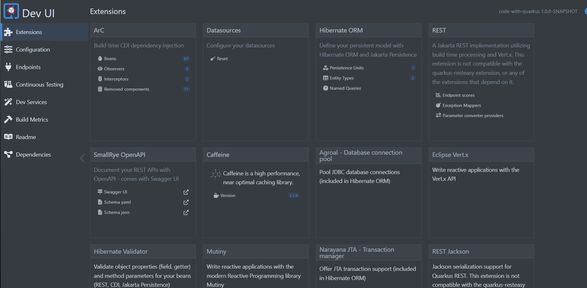

y para visualizar que todo este funcionando correctamente iremos a la ruta http://localhost:8080/swagger-ui/ para visualizar la documentacion de la api

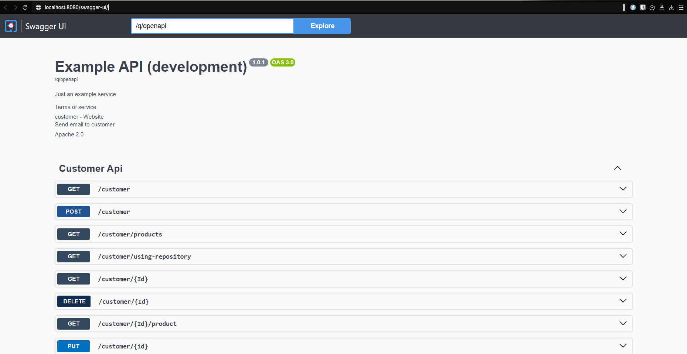


> [!IMPORTANT]
> se debe teenr ejecutando el contenedor donde esta la base de datos para que el microservicio pueda conectarse a la base de datos si no no correra el microservicio
>


### Empaquetar el microservicio
Una vez que se hayan realizado las pruebas en modo desarrollo, se debe empaquetar el microservicio para su despliegue en un entorno de producción. Para empaquetar el microservicio, se debe seguir los siguientes pasos:

1. en el pom.xml se debe agregar la siguiente propiedad para que el microservicio se empaquete en u nejecutable de graalvm

```xml
<quarkus.package.type>native</quarkus.package.type>
<quarkus.native.container-build>true</quarkus.native.container-build>
```

2. Ejecutar el siguiente comando para empaquetar el microservicio en un ejecutable nativo de GraalVM

```bash
./mvnw package -Dnative
```

> [!NOTE]
> Este comando empaqueta el microservicio en un ejecutable nativo de GraalVM, el cual es un ejecutable ligero y rápido que no requiere una JVM para ejecutarse.

### Crear la imagen de docker para el microservicio

Una vez que se haya empaquetado el microservicio, se debe crear una imagen de docker para el microservicio. Para crear la imagen de docker, se debe seguir los siguientes pasos:

1. Como quarkus nos genera los dockerfile lo que haremos es ir a nuestro caso al dokcerfile.native.micro y construiremos la imagen de docker con el siguiente comando

```bash
docker build -f src/main/docker/Dockerfile.native-micro -t quarkus/customer:1.0 .
```

[!NOTE]
> Esta misma construccion se debe hacer para el [microservicio de product](./JDK17/pjba_microservicios_product/)


### Cofiguracion de docker
Ahora vamos a conectar dos microservicios de quarkus en docker, con el [microservicio customer](./JDK17/pjba_microservicio_cliente/) que fue el que se creo en este ejemplo y el [microservicio product](./JDK17/pjba_microservicio_product/) que ya esta creado en el repositorio pero sigue los mismos pasos que el microservicio customer

Para conectar los microservicios de quarkus en docker se debe seguir los siguientes pasos

```bash
docker network create my_network // crea una red en docker para que los contenedores puedan comunicarse entre ellos


docker run -i --rm -p 8080:8080 --network my_network --name customer quarkus/customer:1.0 // corre el contenedor del microservicio customer debemos tener en cuenta que el microservicio debe estar en la carpeta raiz del proyecto

docker run -i --rm -p 8081:8081 --network my_network --name product quarkus/product:1.0 // corre el contenedor del microservicio product debemos tener en cuenta que el microservicio debe estar en la carpeta raiz del proyecto

docker network inspect my_network // confirma que los contenedores esten conectados a la red 
``` 
> [!TIP]
> Hay varias formas de conectar los microservicios de quarkus en docker, en este caso se esta usando una red en docker para que los contenedores puedan comunicarse entre ellos pero tambien se puede hacer mediante un docker-compose o mediante un dockerfile para ver estos modos de conexion se puede consultar en la documentacion de docker
>

Ahora vamos a probar que los microservicios esten conectados entre si, para ello vamos a la ruta http://localhost:8080/swagger-ui/ que es el microservicio customer que consume el microservicio product y comprobaremos /customer/{Id}/product que es el metodo que consume el microservicio product ydebe aparecer de la siguiente manera

ejemplo
<center>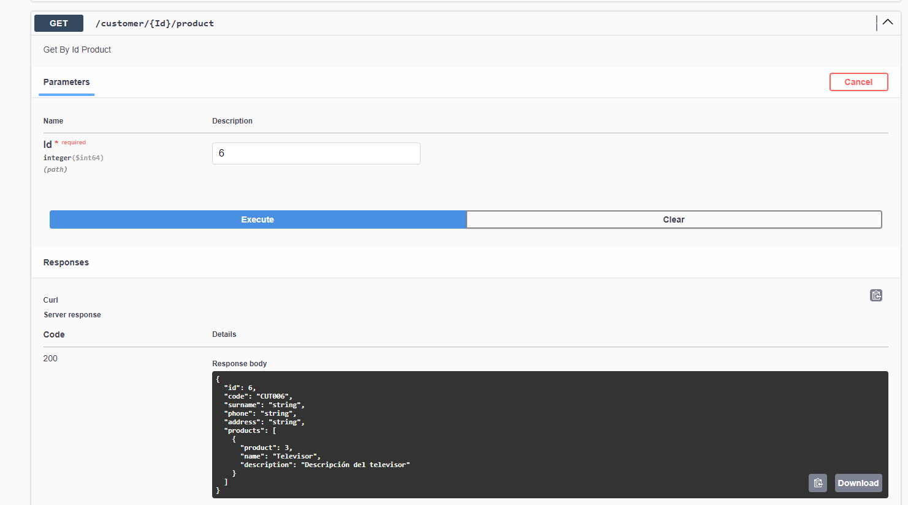</center>

#### Crear una red en docker
En caso de que ya tenga creado los contenedores y quiera conectarlos a una red en docker se puede hacer de la siguiente manera

- primero creamos una red en docker para que los contenedores puedan comunicarse entre si
```bash
docker network create my_network
```

- luego conectamos los contenedores a la red creada
```bash
docker network connect my_network my-quarkus-container
```
En nuestro caso sera a los dos contenedores

```bash

docker network connect my_network customer

docker network connect my_network product
```
ahora confirma que los contenedores esten conectados a la red

```bash
docker network inspect my_network
```

## 3. Subir los contenedores a docker hub
Para subir los contenedores a docker hub se debe seguir los siguientes pasos

1. Iniciar sesion en docker hub
```bash
docker login
```
2. 
```bash
docker commit <container-id> tuusuario/nombreimagen:v1.0

docker commit 28663bcd0e8fb42628ed91643a7f87bdd950cc3a187af6ab0c4a4e1c270ececb avvillas/product:v1.0

docker tag tuusuario/tuimagen:v1.0 tuusuario/tuimagen:v1.0
#este tag  sirve para que la imagen se pueda subir a docker hub
# ejemplo
docker tag avvillas/product:v1.0 avvillas/product:v1.0 

docker push tuusuario/tuimagen:v1.0
# ejemplo
docker push avvilas/product:v1.0
```

para probar que la imagen se haya creado correctamente se puede hacer de la siguiente manera

```bash
docker pull tuusuario/tuimagen:v1.0
# ejemplo
docker pull avvillas/product:v1.0
```

